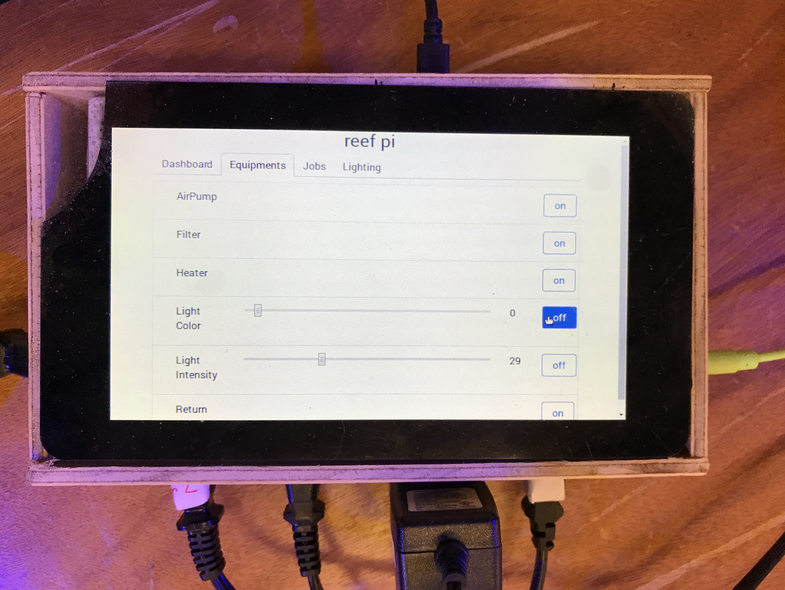

## Pico

This Bill of Material is for a pico reef tank controller & housing, to support 4 primary equiments (heater, return pump, light, filter)

### Electronics

- [Raspberry Pi 3](https://www.adafruit.com/product/3055)
- [Pi touch screen](https://www.adafruit.com/product/2718)
- [5 Volt 2.4 A](https://www.adafruit.com/product/1995) micro usb power supply
- [4 channel relay](https://www.amazon.com/CJRSLRB-G3MB-202P-Duemilanove-Mega2560-Mega1280/dp/B01GCCHBNS/)
- [PCA9685](https://www.adafruit.com/product/815) pwm breakout board
- [MCP3008](https://www.adafruit.com/products/856) Analog to digital converter

### Connectors & wiring

- [AC Inlet](https://www.amazon.com/Inlet-Power-Socket-Switch-IEC320/dp/B00511QVVK/) power socket with fuse.
- [Duplex AC receptacles](https://www.amazon.com/Leviton-T5325-W-Resistant-Receptacle-Grounding/dp/B0012DRL4C/)
- [Female-female jumper](https://www.adafruit.com/product/266) wires
- [3.5 mm female ](https://www.amazon.com/Philmore-Isolated-Stereo-Female-Headphone/dp/B00OGLCR3W) panel mount audio jack
- [Female panel mount BNC](https://www.amazon.com/CESS-Female-Coaxial-Connector-Soldering/dp/B012EELQK2) connector
- [proto board](https://www.adafruit.com/product/3203)
- [IC socket](https://www.adafruit.com/product/2203)

