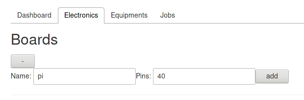
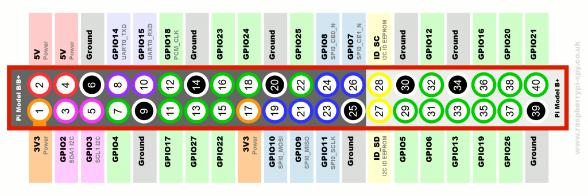
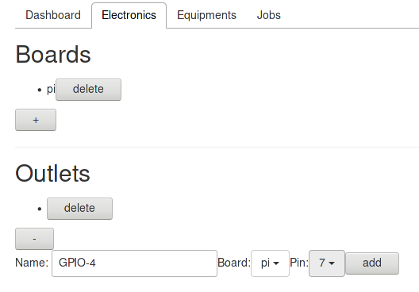
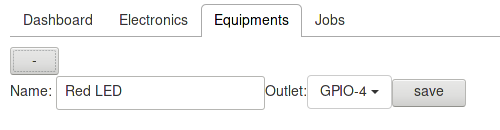
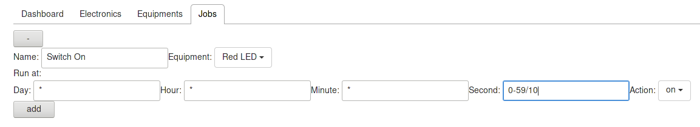
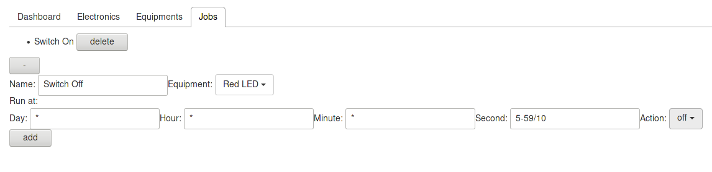
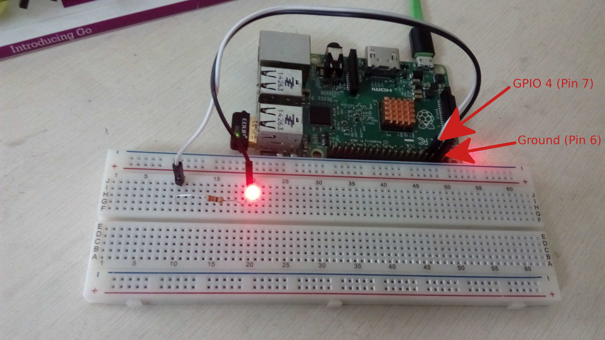

# Make LED blink periodically
 In this section we will make 2 LEDs, Red and Green, turn on and off alternatively and periodically. 
## Steps:
### First LED (red) 

1. Visit reef-pi homepage, go to the 'Electronics' tab

2. Add a board by clicking on the '+' sign, name it anything (let's say pi), and set number of pins to 40, click 'Add'. 

3. Similarly add an outlet. Outlet is the pin on the raspberry-pi which will be used to control the LED. Name the outlet as 'GPIO-4'. The Board is 'pi' which we created in step 2. The value of parameter 'pin' is the location of the pin on the board (see image below). 

	The number in the circle identifies the pin. Let us use pin 7 (which is GPIO4) for our example. Click Add. 

4. Now go to the Equipments tab. Click on '+' to add a new equipment. Let us name it 'Red LED'. Select the outlet created in step 3. Click Save. 
  

5. Now go the 'Jobs' tab.  
 * We will create two jobs, one to switch on the LED every 10 seconds (0,10,20,30,40,50 seconds of the minute) and the other to switch it off 5 seconds after it is switched on (that is 5,15,25,35,45,55 seconds of the minute) 
 * Click on the '+' to add a new job. Let us name it 'Switch On'. Select the equipment created in step 4 (Red LED)
 * In the fields for Day, Hour and Minute fill '*'. This means we want this job to run every day, every hour, every minute
 * In the field for Seconds fill in '0-59/10'. This means "between 0 to 59 seconds at increments of 10 seconds". Select Action to be 'on'. Click Add

 * Similarly, add a 'Switch off' job for 'Red LED'. Change seconds to '5-59/10'(increments of 10 seconds starting at 5) and Action to be off'. Click Add 

6. The configuration is done. Now Connect an the positive side of an LED (with a roughly 1k resistor in series) to the outlet (pin 7) which we configured on the pi in step 3. Connect the negative end to the 'Ground pin' (pin 6, see image in step 3).

	The Led should turn on and off every 5 seconds. 

### Second LED (Green)
We need to repeat Steps 3 to 5 for the second LED while configuring another pin and different on-off times.

7. Repeat Step 3 but name the outlet as 'GPIO-14' and set value of pin as 8.

8. Repeat Step 4. Name the new Equipment as 'Green LED' and outlet as 'GPIO-14' which we just created in above step.

9. Repeat Step 5. Create 'Switch on' Job for Equipment 'Green LED' with the value in seconds field as '5-59/10'. Thus Green LED will switch on when Red LED will switch off. Similarly, create 'Switch Off' job for 'Green LED' at seconds '0-59/10'. Thus Green LED swicthes on when Red LED switches off and vice-versa.

10. Now physically connect the positive end of a Green LED with pin 8 (GPIO-14) through another resistor and connect the negative end with the 'Ground'.

You should now have the Red and Green LEDs blinking alternatively and periodically. 
