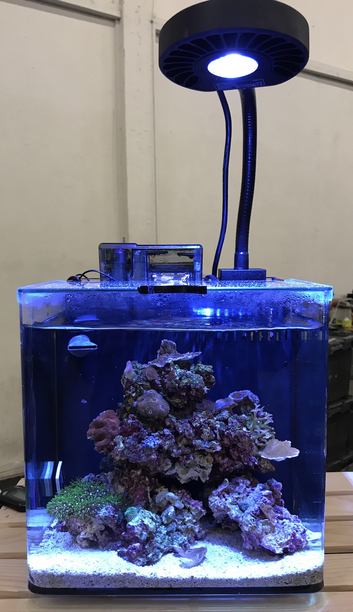

## Bozeman

Named after he beautiful [smalltown](https://en.wikipedia.org/wiki/Bozeman,_Montana) of montana,
bozeman is home of visible copepods and handful of asterina star fish. It has two distinct levels, a
valley within. The top level is acan dominant, while GSP and ricordia sits on the bottom level.

- Aquarium. [Imagitarium 3.7G]()
- Setup date: September, 2016
- Aragonite sand depth (depth 0.5"), live rock.

### Equipments

- Heater: [Aqueon 100w]()
- Return: [Rio 90]()
- Light: [Kessil A80]()
- Filter: [AquaClear 20 Hang On Back Filter]()

### Corals

- Acans: 1 rainbow acan & 3 acan lord
- Red montipora
- Green  pociliopora 
- Purple death paly, utter chaos palythoa
- Ricordia florida
- Green star polyp

### Invertebrates:

- 2 sexy shrimp (Thor amboinensis)
- 1 trochus snail & 1 blue legged hermit crab

