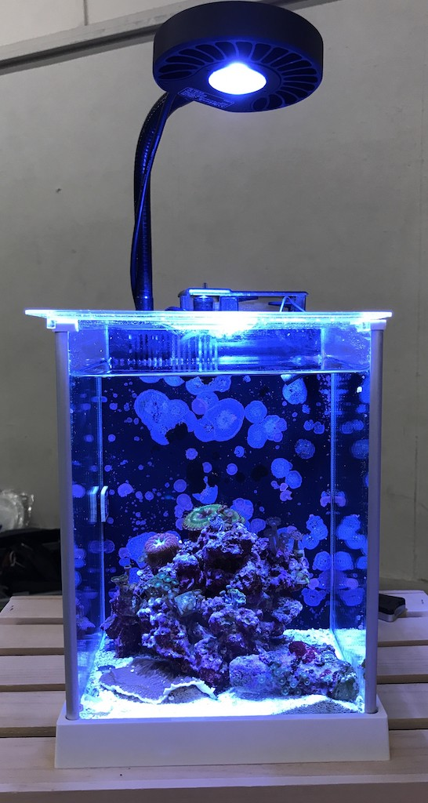

## Healdsburg 

Named after one of the famous small town of california, this pico reef tank house zoas and palys mostly. The entire rockscape is compose of a single large live rock at center and a small tonga branch in one corner. This tank has visible coralline algae in its back wall.

- Aquarium. [Fluval Spec 3](https://www.amazon.com/Fluval-Spec-Aquarium-2-6-Gallon-Black/dp/B009K0ZKAQ)
- Setup date: June, 2016
- Aragonite sand (sparse), live rock.

### Equipments

- Heater: [Aqueon 100w]()
- Return: [Rio 90]()
- Light: [Kessil A80]()
- Filter: [AquaClear 20 Hang On Back Filter]()

### Corals

- Grandis paly
- Blastomussa
- Eagle eye zoa
- Starfire paly
- Rasta zoa
- Green lantern zoa	

### Invertebrates

- 1 Anemone shrimp & 1 Trochus snail

